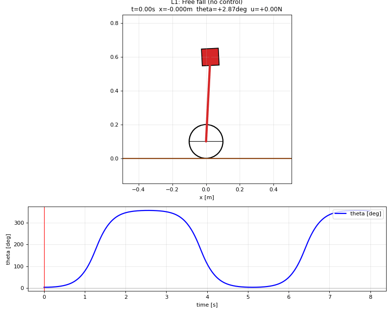
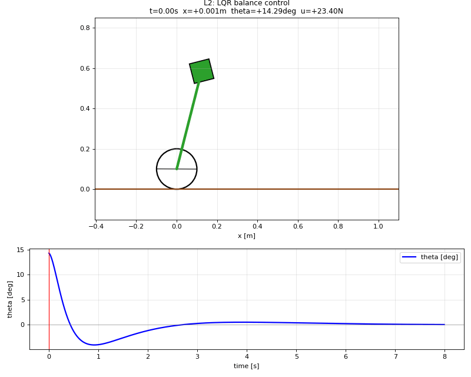
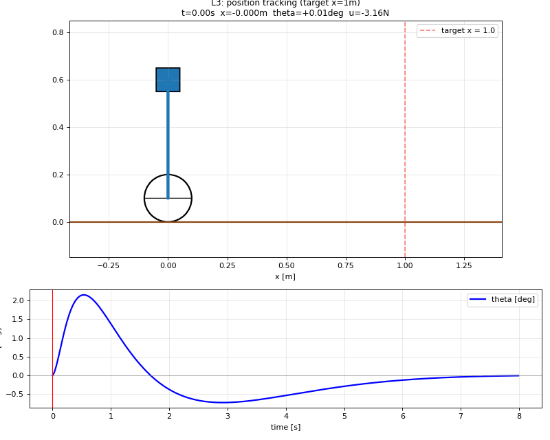
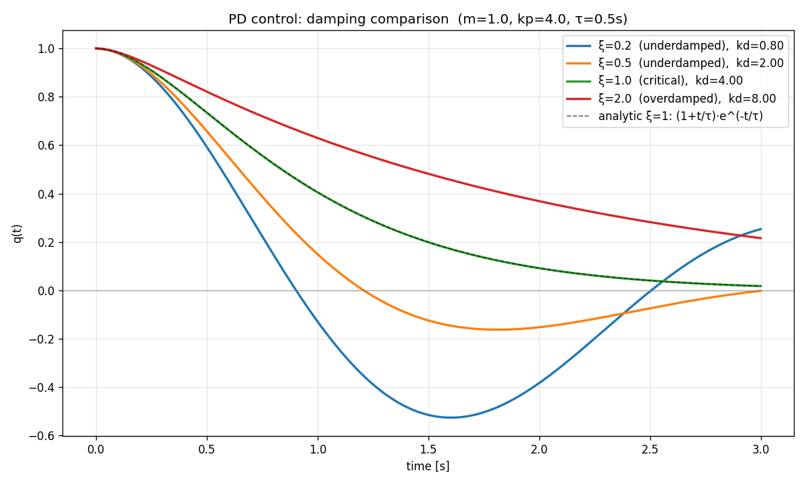
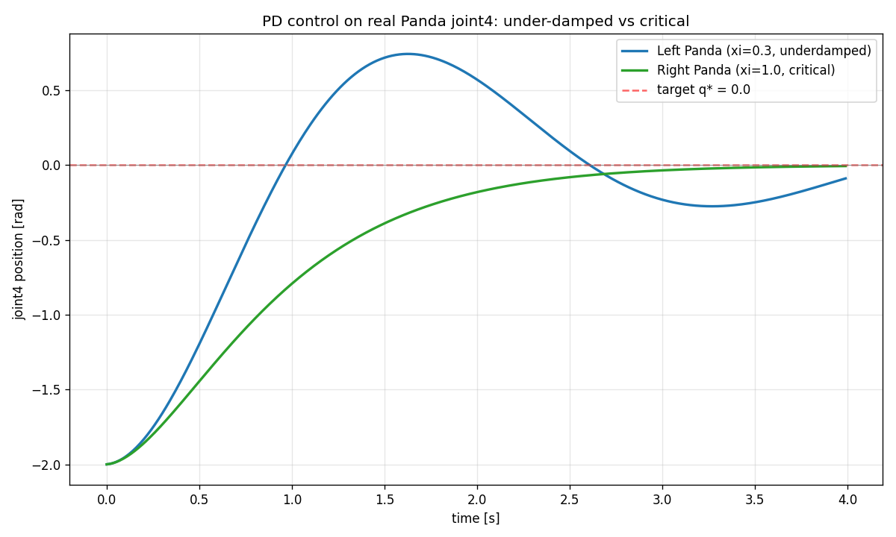
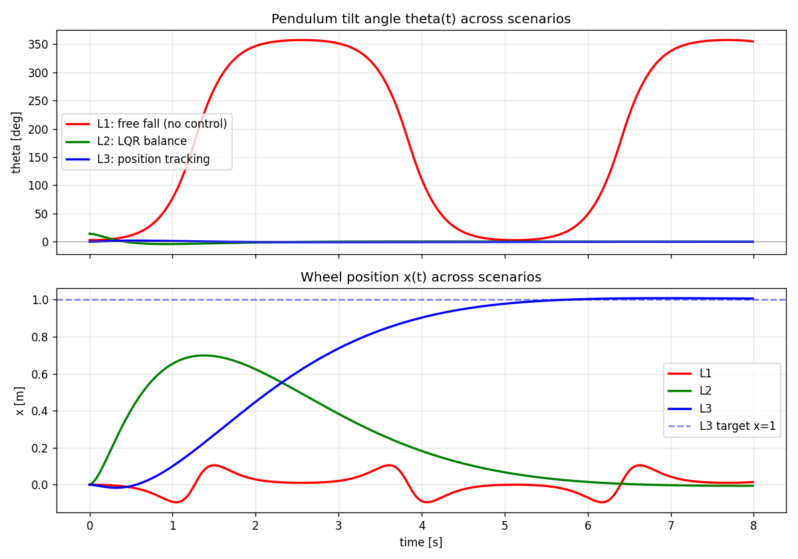
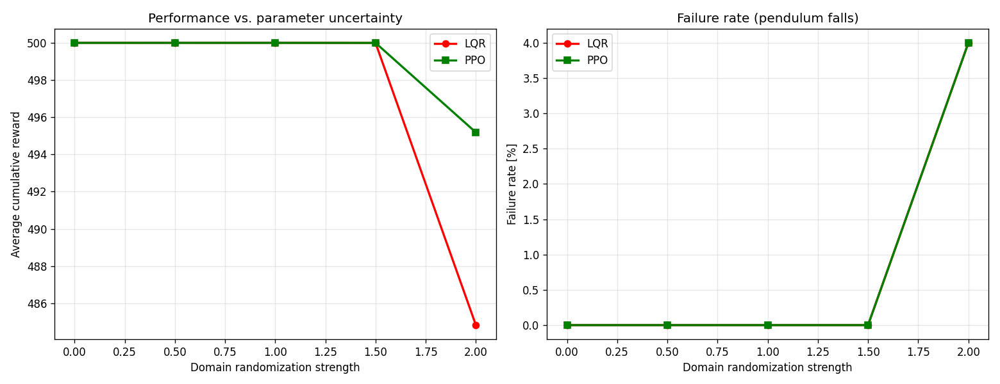

# Robot Learning — TU Berlin Summer 2025

Implementation of *Robot Learning* (Prof. Marc Toussaint & Wolfgang Hönig, TU Berlin) Week 1 assignments, plus a self-initiated **PPO vs. LQR robustness study** on the Segway inverted pendulum system.

## 🎬 Demos

### Segway Stabilization Across Three Scenarios

| L1 — Free fall (no control) | L2 — LQR balance | L3 — Position tracking |
|:--:|:--:|:--:|
|  |  |  |
| Pendulum falls — verifies the unstable equilibrium | LQR recovers from 14° tilt to 0.03° | Wheel reaches `x=1m` while staying balanced (note: leans backward to accelerate) |

## 📋 Project Structure

| File | Description | Concepts |
|------|-------------|----------|
| `01_inverse_kinematics.py` | Side-by-side soft (μ=0.5) vs. hard (μ→∞) constraint IK on dual Panda arms | Damped Least Squares, Woodbury identity |
| `02_pd_control.py` | Three-damping comparison + time-constant analysis (matplotlib) | Critical damping, time constant τ |
| `02_robot_simulation.py` | **Live PD control on real Panda joints** (under-damped vs. critical, dual robots) | Real-robot control, gain tuning |
| `03_segway_lagrange.py` | Segway dynamics from Euler-Lagrange + LQR balance controller | Underactuated control, linearization, Riccati equation |
| `segway_env.py` | Gymnasium wrapper for the Segway dynamics | RL environment standard |
| `04_train_segway_rl.py` | PPO training with domain randomization (±100% physical params) | Sample-efficient RL, parallel envs |
| `05_evaluate_rl.py` | Head-to-head evaluation: LQR vs. PPO across randomization levels | Robustness benchmarking |
| `diagnose.py` | Per-trial diagnostic to identify *which* parameters cause PPO failures | Debug-driven engineering |

## 📊 Key Results

### PD Control: Damping Comparison



The four curves correspond to different damping ratios ξ. The dashed black line is the analytical critical-damping solution `(1 + t/τ)·exp(-t/τ)` — perfectly overlapping the numerical green curve, validating the simulation against theory.

### PD Control on a Real Panda Joint



The blue curve (under-damped, ξ=0.3) overshoots from −2 rad to **+0.74 rad** before oscillating back. The green curve (critically damped, ξ=1.0) converges monotonically — the textbook industrial-robot behavior.

### Segway: Three-Scenario Summary



Red (L1, no control) winds up to 360°. Green (L2, LQR) brings θ back to 0 within seconds. Blue (L3, tracking) walks smoothly to x=1m.

### PPO vs. LQR Under Domain Randomization



After 4 iterations of debugging (V1→V4), the final results at ±100% parameter randomization:

| Strength | LQR fail rate | PPO fail rate | LQR reward | PPO reward |
|:--:|:--:|:--:|:--:|:--:|
| 0.0 | 0% | 0% | 500.0 | 500.0 |
| 1.0 | 0% | 0% | 500.0 | 500.0 |
| 1.5 | 0% | 0% | 500.0 | 500.0 |
| **2.0** | **4%** | **4%** | 484.8 | **495.2** |

**Despite matching LQR's failure rate at ±100% randomization, PPO achieves a slightly higher mean reward — a tied draw with a marginal data-driven edge.**

### Lessons Learned

1. **Reward shaping is decisive.** Switching from `1 − θ²` to `cos(θ)` (and removing the −100 termination penalty) was the single most impactful change — moving PPO from 98% failure to convergence.
2. **Train distribution must match test distribution.** Training on ±50% randomization but evaluating at ±100% caused 18% PPO failure (extrapolation problem). Expanding to ±100% training distribution fixed it.
3. **Diagnostics > raw metrics.** A simple "PPO 14% vs. LQR 4%" headline hides the truth: per-trial analysis revealed that 84% of trials were ties, 12% PPO-only failures, and 2% PPO-only successes.
4. **Classical control wins on simple, modeled systems.** RL's advantage emerges only when the dynamics model fails — not on textbook benchmarks like Segway.

## 🛠️ Setup

```bash
# Tested on Ubuntu 22.04 (WSL2), Python 3.10, CUDA 13.0 (GPU optional)

python3 -m venv venv
source venv/bin/activate

# Core dependencies
pip install robotic numpy scipy matplotlib

# RL extension
pip install stable-baselines3 gymnasium
```

## 🚀 Reproducing the Results

```bash
# Assignment problems
python3 01_inverse_kinematics.py     # IK comparison
python3 02_pd_control.py              # PD damping curves → 2 PNGs
python3 02_robot_simulation.py        # Live PD on Panda
python3 03_segway_lagrange.py         # Segway scenarios → 3 GIFs

# RL extension
python3 04_train_segway_rl.py         # 5–10 min on GPU
python3 05_evaluate_rl.py             # LQR vs. PPO benchmark
python3 diagnose.py                   # Per-trial breakdown
```

## 📚 References

- Course: TU Berlin *Robot Learning* (Summer 2025)
- Instructors: Marc Toussaint & Wolfgang Hönig, [Learning & Intelligent Systems Lab](https://argmin.lis.tu-berlin.de/)
- Simulation: [`robotic`](https://github.com/MarcToussaint/robotic) by Marc Toussaint
- RL framework: [Stable-Baselines3](https://github.com/DLR-RM/stable-baselines3)

## 📜 License

MIT
